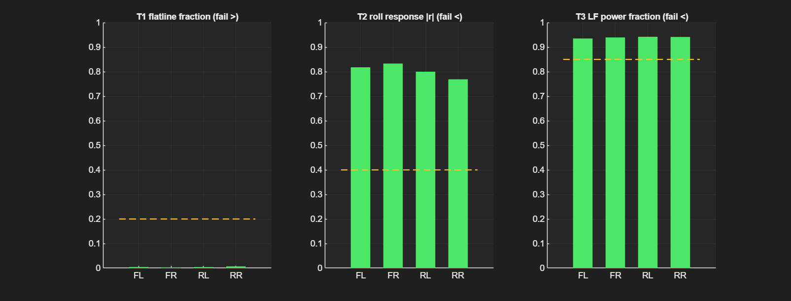
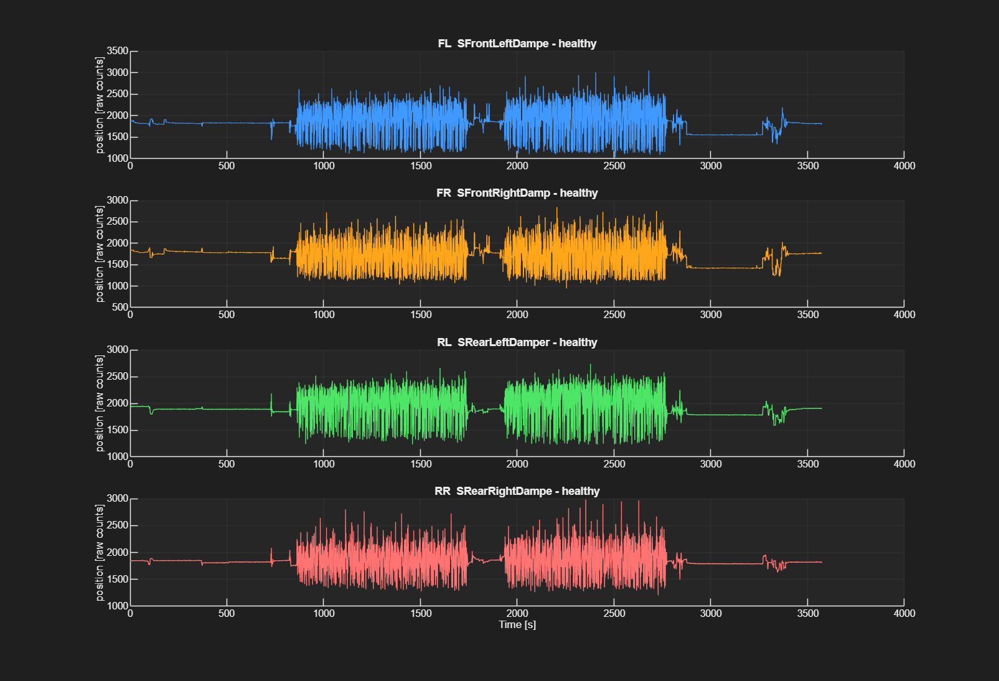
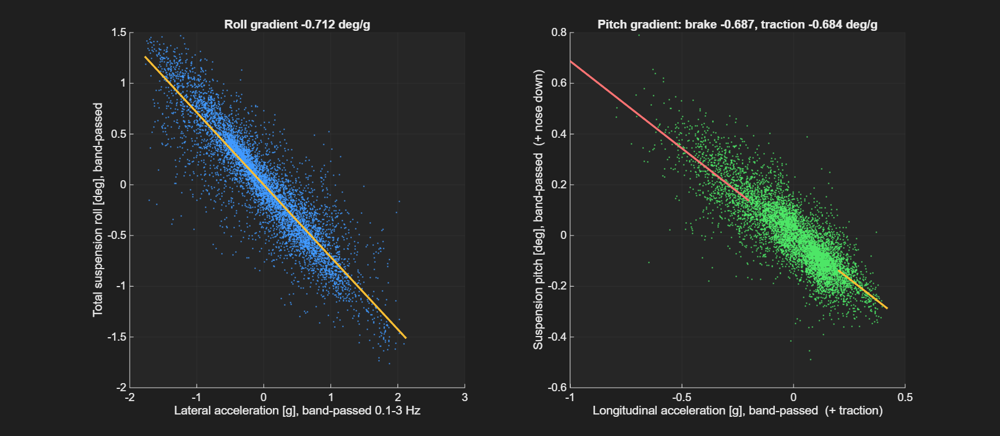
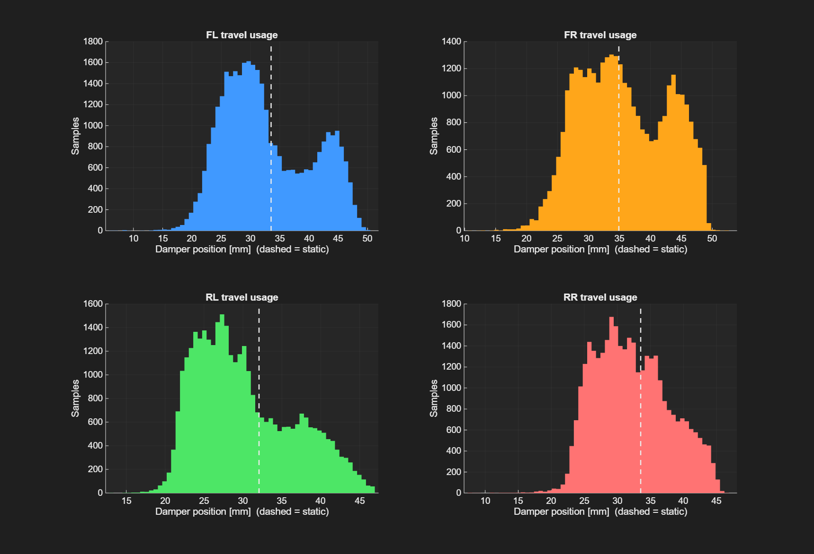
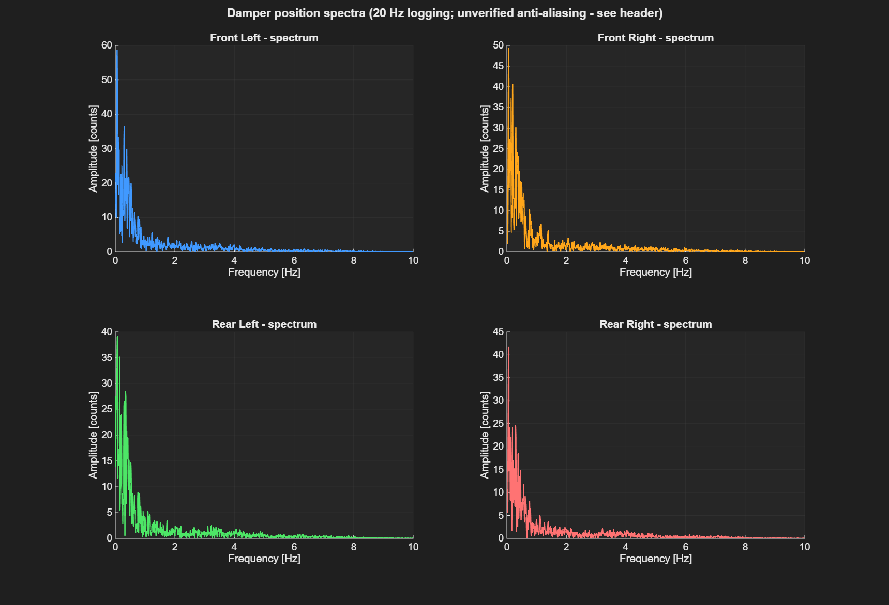
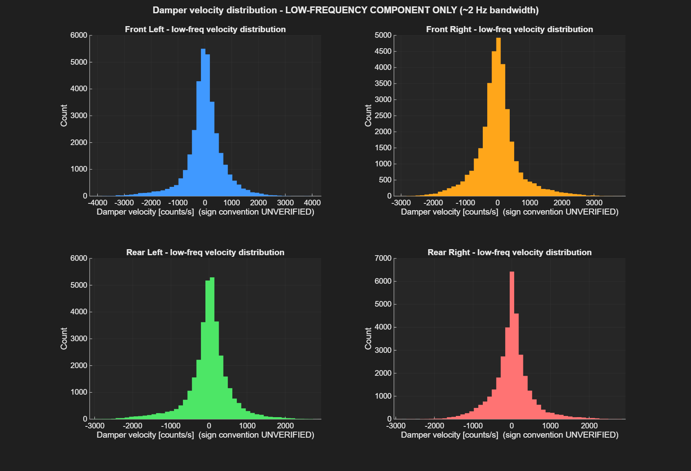

# TBRe25 Damper Telemetry Analysis — Channel Health, Calibration & Suspension Gradients

Analysis suite for Formula Student damper position telemetry (AiM, 20 Hz),
built on Team Bath Racing Electric 2025-car endurance data. MATLAB,
toolbox-free (own CSV reader, filters, Welch PSD), also runs in GNU Octave.

Four tools, in the order they should be run:

1. **`damper_channel_health.m`** — automated detection of dead, intermittent
   or contaminated damper channels, with fault-mode classification and onset
   localisation.
2. **`validate_channel_health.m`** — validation harness for (1): false-alarm
   sweep on known-healthy data + synthetic fault injection.
3. **`suspension_position_analysis.m`** — roll/pitch gradients, travel usage
   and static-shift checks, on channels that pass (1).
4. **`damper_frequency_response.m`** — spectra and low-frequency velocity
   distributions, with the 20 Hz band limits stated on every output.

No telemetry is included in this repository (team data). Every number below
was produced by running this code on the described files.

---

## 1. Channel health check

**Why it exists:** the rear damper pots detached during the FSUK endurance
event (team-confirmed). The faults had been spotted by eye. This tool replaces
eyeballing with tests validated against the real failure — and found that the
*front* channels in the same file, which look plausible and were assumed
usable, were not measuring suspension either.

Run on two endurance sessions of the same car:

| File | FL | FR | RL | RR |
|---|---|---|---|---|
| FSG25 endurance (59.5 min, 22 km) | PASS | PASS | PASS | PASS |
| FSUK endurance (16.4 min) | FAIL — contaminated | FAIL — contaminated | FAIL — intermittent | FAIL — hard failure |

Three fault modes discriminated automatically in the FSUK file:

- **RR — hard failure.** Reads 0 from the first sample; 99.4% of consecutive
  moving samples identical.
- **RL — intermittent, onset localised.** 1,279 dropouts toward zero, first at
  t ≈ 30 s, 13% of the run lost; baseline noise between dropouts 5–7× the
  healthy level (loose connector signature, not clean disconnection).
- **FL / FR — contaminated.** Dominant content correlates with **front brake
  pressure** (|r| = 0.87 / 0.58), not chassis motion. Through a sustained
  1.0 g corner FL moves 122 raw counts peak-to-peak where a healthy front
  moves ~1,230 at comparable lateral g. Crosstalk vs logger channel-mapping
  is not resolvable from the data; either way the channels are unusable.

*All four corners on the healthy FSG file, against the three thresholds
(dashed). Note the T3 margin is the tightest of the three — 0.94 against a
0.85 threshold — which is why T3 is documented as file-level support rather
than a primary test.*

*Per-channel timeline with the verdict in each title. The two driving stints
are visible either side of the driver change at t ≈ 1745–1911 s, and the
handling event at t ≈ 3250–3400 s that produces the transient static shift
discussed in section 3.*

### Tests

Moving samples only (>3 m/s):

| Test | Metric | Healthy | Faulty | Threshold |
|---|---|---|---|---|
| T1 Flatline | fraction of zero consecutive diffs | ≤ 0.011 (worst 60 s window) | 0.994 | > 0.20 |
| **T2 Roll response** (primary) | \|r\| between 0.1–3 Hz band-passed damper signal and band-passed lateral acceleration | ≥ 0.59 (windowed min) | ≤ 0.19 (windowed max, all fault instances) | < 0.40 |
| T3 Low-freq fraction | PSD power 0.1–1 Hz / power > 0.1 Hz | 0.94 (all corners) | 0.25–0.82 | < 0.85, file-level only |

T2 rests on a physical argument: a functioning damper channel on a circuit
must respond to roll. It is amplitude-invariant by design, because one real
fault (RL) presents with *normal* amplitude and defeats any variance test.
T3 is file-level support only — windowed, the healthy minimum (0.89) and the
contaminated channel's best window (0.92) overlap.

### Validation

- **Real data:** 4/4 pass on the team-confirmed healthy session, 4/4 fail on
  the team-confirmed failed session, fault modes as above.
- **False-alarm sweep:** 55 rolling 60 s windows × 4 healthy channels —
  **0 false positives in 220 channel-windows**; worst margins: flatline 0.011
  vs 0.20, roll |r| 0.572 vs 0.40, LF 0.894 vs 0.85.
- **Synthetic injection** (into a healthy channel): stuck → T1,T2;
  zero-rail → T1,T2; variance-matched noise → T2,T3; brake-pressure
  crosstalk → T2,T3 (matches the real FSUK front detection); 5% dropout
  bursts → T3 (T2 degrades to 0.44 without tripping — the tests cover each
  other); **signal at 50% amplitude → MISSED**. The miss is documented, not
  patched: catching a partial-gain fault needs a cross-session amplitude
  baseline this tool doesn't have.

### Tested and rejected (kept for the record)

- *0.5–5 Hz band power* — the faulty RL scores **higher** than healthy
  channels; wrong band (healthy content is 94% sub-1 Hz).
- *Variance / consensus outlier tests* — RL's variance is inside the healthy
  range and the contaminated fronts are low; flags the wrong channels for the
  wrong reasons. With 2 of 4 channels faulty, median/MAD estimators sit at
  their breakdown point.
- *Correlation vs the mean of the other corners* — the reference is
  contaminated by the faulty channels themselves; an independent sensor
  (accelerometer) is used instead.

---

## 2. Instrumentation findings (apply to every analysis on this car)

**The IMU is mounted rotated ~90° about vertical.** Four channel names are
wrong with one root cause: `InlineAcc` is lateral (r = +0.974 vs
v·yaw-rate), `LateralAcc` is longitudinal sign-inverted (r = −0.870 vs
dV/dt), and `RollRate`/`PitchRate` are swapped (damper-derived roll rate
matches `PitchRate` at |r| = 0.75, matches `RollRate` at 0.07). `YawRate`
(z-axis) is unaffected, as a vertical-axis rotation predicts. The tools
therefore identify axes **empirically from kinematics** at runtime and refuse
to use an unverified reference.

**The calibrated damper stream (`FLDPS`-style) is unusable for dynamics.**
It sample-holds ~20% of moving samples with stalls up to 5.85 s while the car
is moving, all four channels stalling for identical durations — transport-level
CAN gaps padded by the logger, not sensor behaviour. It also lags the raw ADC
stream by 1.75 samples (88 ms) on all four corners. All analysis here uses the
raw stream.

**Counts→mm calibration, derived rather than assumed.** Fitting the raw
stream against the (held-sample-excluded, lag-aligned) calibrated stream:
scale −0.02260 mm/count agreeing across all four pots to 0.12%, offsets
~74.7 mm, residuals 0.92–1.19 mm per corner (2.2–3.1 mm before the hold/lag
corrections). One sensor model, one scale — and a number the instrumentation
lead can confirm rather than be asked to produce.

**Sign convention verified at runtime, not assumed:** decreasing mm =
compression (hardest 200 braking samples: fronts +3.98 mm compression, rears
−9.07 mm extension). The analysis aborts if this check fails on a new file.

---

## 3. Suspension position analysis (FSG25 endurance results)

All gradients are fitted on 0.1–3 Hz band-passed signals (both axes), so
they describe transient/corner-scale response; content slower than ~10 s is
high-passed out. Plot axes are labelled accordingly.

| Quantity | Value | Evidence |
|---|---|---|
| Total roll gradient | **0.712 deg/g** | r = 0.904 over 34,481 moving samples |
| Peak lateral acceleration seen | 2.08 g | — |
| Front / rear roll gradients | 0.704 / 0.720 deg/g | difference 0.016 deg/g |
| Pitch gradient, braking | 0.687 deg/g nose-down | r = 0.58, n = 5,021 |
| Pitch gradient, traction | 0.684 deg/g squat | r = 0.45, n = 3,428 |
| Braking vs traction difference | **0.4% — no measurable asymmetry** | — |
| Stroke used (p99–p1) | 21.9–27.8 mm per corner | damper domain |
| Time within 1 mm of observed travel extremes | ≤ 0.27% | bump-stop-proximity proxy only |

*Both axes are 0.1–3 Hz band-passed, labelled as such. Left: total suspension
roll vs lateral acceleration, 0.712 deg/g at r = 0.904. Right: pitch vs
longitudinal acceleration with braking (red) and traction (yellow) fitted
separately — the two slopes are visually indistinguishable, which is the
null result reported below.*

*Damper position distribution per corner, dashed line = static. The bimodality
is roll: each corner's extended tail sits at ~1.1 g mean lateral with left and
right mirrored in sign.*

Notes that matter as much as the numbers:

- **The front–rear roll-gradient difference is chassis compliance/warp under
  lateral load, NOT the roll stiffness split.** With a rigid chassis, front
  and rear roll angles are equal regardless of stiffness distribution — the
  split governs load transfer, not angle, and cannot be recovered from damper
  positions alone. The measured 0.016 deg/g difference (2% of total) says the
  chassis is torsionally stiff relative to the suspension; decomposing the
  stiffness split needs spring/ARB rates.
- Left/right roll labelling is **not asserted**: the fitted sign depends on
  the yaw-rate sign convention, unverified on a logger where every other IMU
  name is wrong. Magnitude is the deliverable.
- **IMU cross-check:** damper-derived roll rate vs the empirically identified
  roll-rate channel: |r| = 0.75 in 0.2–2 Hz. The amplitude ratio (0.62) is
  *not* treated as a scale check: IMU units are assumed, the IMU sees
  suspension-plus-tyre roll, and residual mount misalignment leaks yaw rate
  (an order of magnitude larger than roll rate) into the horizontal axes.
  Shape/timing agreement is the validation content.
- **Pitch gradients under braking and traction agree to 0.4%.** The response
  is linear and direction-independent, i.e. dominated by longitudinal load
  transfer through the springs rather than by differing anti-dive/anti-squat
  geometry. Reported as a null result — no asymmetry is quoted from this data.
- **Travel histograms are bimodal, and the modes are roll.** The extended tail
  of each corner sits at ~1.1 g mean lateral acceleration with left and right
  corners mirrored in sign (FL extended at −1.15 g, FR extended at +0.99 g):
  outside-vs-inside wheel on a direction-biased circuit. Vehicle behaviour,
  not a data artefact, and consistent with the 94% sub-1 Hz spectral content.
- **Static positions extend up to +6.4 mm mid-file, then return.** The tool
  prints every stationary block rather than an early-vs-late number, and the
  block table settles the question: pre-session FL/FR/RL/RR sit at
  33.53/34.13/30.81/32.98 mm, the block at t = 2858–3280 s reads
  39.59/42.61/34.35/34.21 mm, and the final block at t = 3402–3573 s returns
  to 33.59/35.00/31.76/33.56 mm — **within ~1 mm of the original**. The
  mid-session driver-change stop also matches pre-session to within 1.2 mm.
  A persistent cause (driver egress, tyre pressure decay, sensor-mount
  slip) cannot produce a shift that reverses. The channel timeline shows
  movement on all four corners at t ≈ 3250–3400 s with the car below the
  speed gate, i.e. the car handled and set back down. The extended block is
  a transient off-wheels state, and **the pots return to their zero after
  being physically disturbed** — a stronger integrity result than "no drift
  observed." *(Earlier versions of this analysis attributed the shift first
  to the driver change, then left the cause open; the per-block table
  disproved the first and resolved the second.)*
- Angles are suspension (wheel-to-chassis) roll/pitch; tyre deflection is not
  measured. Motion ratio treated as constant (0.9 F / 0.69 R).

---

## 4. Frequency / velocity script

Retained with its limits stated on every output rather than implied:
20 Hz → 10 Hz Nyquist, wheel-hop (~12–18 Hz) unresolvable, and without
documented anti-alias filtering ahead of the sampler, low-frequency content
cannot be certified free of folded high-frequency energy. Velocity histograms
are ~2 Hz-band components (20 Hz differentiation + smoothing), **not** peak
damper velocities, in the damper domain, with the bump/rebound sign labelled
unverified. The standard low-speed/high-speed damper histogram split that
drives damping decisions is **not achievable at this logging rate** — that is
an acquisition limitation and is stated as one. Selects a contiguous
≥95%-moving segment automatically (the earlier version could straddle a stop
and a sensor-failure onset).

*Every corner shows the same shape: energy collapsing above ~1 Hz with no
resolvable resonance peak. This is the evidence for the claim that 20 Hz
logging cannot support conventional damper frequency analysis on this car —
the plot is included because the negative result is the point, not because
it reveals a feature.*

*Velocity distributions, ~2 Hz bandwidth. Symmetric and heavy-tailed, with
bump/rebound mean ratios of 0.89–1.06. These are **not** peak damper
velocities and the sign convention is labelled unverified on the axis.*

## Known limitations, whole repo

- Health-check validation basis is n = 8 channels (2 sessions, 4 fault
  instances in 3 modes) plus synthetic injection; thresholds are set from
  windowed distributions with ~1.5–2× margins, not from a fleet.
- T2 requires lateral excitation and a healthy accelerometer + yaw-rate +
  speed reference; the tool reports lateral RMS and disables itself if the
  axis self-check fails.
- Calibration residual ~1 mm sets the absolute-position noise floor;
  differential quantities partially cancel it.
- FSUK front-channel attribution (crosstalk vs channel mapping) needs the
  AiM config for that session; not resolvable from data.

All code self-authored. Telemetry courtesy of Team Bath Racing Electric;
raw data not published.
